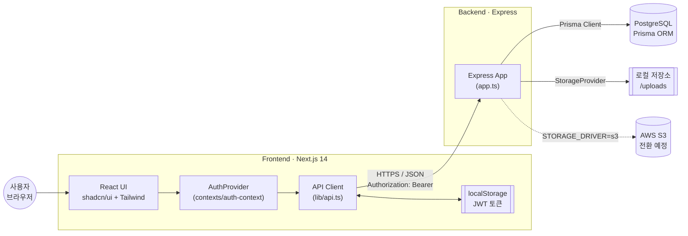

# 🍳 RecipeShare — 레시피 공유 서비스

레시피를 작성·공유하고 다른 사람의 요리를 발견하는 풀스택 예제 프로젝트.

## 시스템 구성



> 시퀀스·ERD·배포 등 상세 다이어그램은 [`docs/ARCHITECTURE.md`](./docs/ARCHITECTURE.md) 참고.

## 스택

| 영역          | 기술                                                        |
| ------------- | ----------------------------------------------------------- |
| Frontend      | Next.js 14 (App Router) + TypeScript + Tailwind + shadcn/ui |
| Backend       | Express + TypeScript                                        |
| Database      | PostgreSQL (Prisma ORM, dev는 Docker)                       |
| 인증          | JWT (Bearer 토큰)                                           |
| 이미지 업로드 | 로컬 파일 저장 (S3 전환 가능한 추상화 계층)                 |

## 구조

```
recipe/
├── docker-compose.yml      # backend + frontend 동시 실행
├── .prettierrc.json        # 공통 코드 포맷 규칙
├── .editorconfig
├── .husky/pre-commit       # 커밋 전 lint-staged 실행
├── package.json            # 공통 tooling (prettier, lint-staged, hooks 스크립트)
├── backend/        # Express API
│   ├── Dockerfile
│   ├── eslint.config.mjs
│   ├── prisma/     # schema.prisma + 마이그레이션 + seed
│   └── src/
│       ├── config/       # 환경변수 로딩/검증
│       ├── lib/          # Prisma client
│       ├── controllers/  # 요청 핸들러 (auth, recipe, upload)
│       ├── middlewares/  # auth, error, upload(multer)
│       ├── routes/       # 라우팅 정의 (controllers 연결)
│       ├── storage/      # StorageProvider 추상화 (local → s3)
│       └── utils/        # jwt, errors, asyncHandler
└── frontend/       # Next.js 앱
    ├── Dockerfile
    └── src/
        ├── app/         # 페이지 (홈/로그인/회원가입/레시피)
        ├── components/  # shadcn/ui + SiteHeader
        ├── contexts/    # AuthProvider
        └── lib/         # API 클라이언트, 타입
```

## 실행

이 저장소는 **pnpm workspace** 모노레포입니다(`packageManager: pnpm@9.15.9`). pnpm은 Node 내장
corepack으로 자동 사용됩니다(`corepack enable` 한 번이면 충분, 별도 전역 설치 불필요).

### 1. 설치 (루트에서 한 번)

```bash
cd recipe
corepack enable                       # pnpm 활성화 (최초 1회)
cp backend/.env.example backend/.env  # JWT_SECRET 채우기: openssl rand -hex 32
cp frontend/.env.example frontend/.env.local
pnpm install                          # backend + frontend 한 번에 설치
```

> DB는 **PostgreSQL**입니다. 가장 쉬운 개발 경로는 아래 Docker 개발 환경입니다.

### 2. 개발 환경 — Docker (권장)

Postgres + 백엔드(hot reload) + 프론트(Fast Refresh)를 한 번에 띄웁니다.

```bash
docker compose -f docker-compose.dev.yml up --build
# frontend → http://localhost:3000 · backend → http://localhost:4000 · db → localhost:5433
```

- 소스는 bind-mount되어 **저장 시 자동 반영(hot reload)** — 재빌드 불필요
- 시작 시 `prisma migrate deploy`로 스키마 자동 적용
- 데이터(`pgdata`)·업로드 이미지(`backend_uploads`)는 named volume에 보존
- 데모 데이터: `docker compose -f docker-compose.dev.yml exec backend pnpm --filter ./backend db:seed`
- 종료: `… down`(DB 보존) / `… down -v`(DB까지 삭제)

### 3. 개발 환경 — 비(非)도커 로컬

DB만 컨테이너로 쓰고 앱은 로컬에서 실행합니다.

```bash
docker compose -f docker-compose.dev.yml up -d db   # Postgres만 (host 5433)
pnpm db:migrate                                      # 스키마 적용
pnpm db:seed                                         # (선택) demo@recipe.dev / password123
pnpm dev                                             # backend(:4000) + frontend(:3000)
```

> `backend/.env`의 `DATABASE_URL`은 `localhost:5433`을 가리킵니다(호스트 5432의 기존 Postgres와 충돌 회피).

### 4. 프로덕션(예시) Docker

```bash
JWT_SECRET="$(openssl rand -hex 32)" docker compose up --build
```

## 공통 개발 도구 / 워크스페이스

루트(`recipe/`)에서:

```bash
pnpm build             # 전체 빌드 (pnpm -r build)
pnpm lint              # 전체 lint
pnpm typecheck         # 전체 tsc --noEmit
pnpm format            # 전체 코드 포맷 (prettier)
pnpm format:check      # 포맷 검사 (CI용)
pnpm hooks:install     # 커밋 전 lint-staged 훅 활성화
pnpm hooks:uninstall

# 개별 패키지 대상 명령 / 의존성 추가
pnpm --filter ./backend lint
pnpm --filter ./backend add <pkg>      # 런타임 의존성
pnpm --filter ./frontend add -D <pkg>  # 개발 의존성
```

**공유 버전(catalog):** `typescript`, `@types/node`는 `pnpm-workspace.yaml`의 `catalog:`에서
한 곳으로 관리됩니다. 버전 변경은 catalog만 수정하면 두 패키지에 반영됩니다.

### Git hooks

`.husky/`에 3개 훅이 정의되어 있습니다(의존성 없이 동작):

| 훅           | 동작                                                                             |
| ------------ | -------------------------------------------------------------------------------- |
| `pre-commit` | 스테이징 파일 포맷(`lint-staged` → prettier) + 워크스페이스 린트(`pnpm -r lint`) |
| `commit-msg` | **Conventional Commits** 형식 검증 (`type(scope)?: subject`)                     |
| `pre-push`   | 테스트 실행(`pnpm -r --if-present test`) + 타입체크                              |

**커밋 메시지 규칙** — `type`: `feat·fix·docs·style·refactor·perf·test·build·ci·chore·revert`
예: `feat(backend): 레시피 검색 API 추가`

**활성화 상태:** recipe는 자체 git 저장소(`git init` 완료)이며 훅이 활성화되어 있습니다
(`core.hooksPath = recipe/.husky`). recipe 커밋/푸시에만 적용되고 상위 책 저장소에는 영향이 없습니다.

```bash
pnpm hooks:install     # 재활성화 (core.hooksPath → recipe/.husky)
pnpm hooks:uninstall   # 비활성화
```

## API 요약

| 메서드 | 경로                 | 인증        | 설명                               |
| ------ | -------------------- | ----------- | ---------------------------------- |
| POST   | `/api/auth/register` | -           | 회원가입                           |
| POST   | `/api/auth/login`    | -           | 로그인                             |
| GET    | `/api/auth/me`       | ✅          | 내 정보                            |
| GET    | `/api/recipes`       | -           | 레시피 목록                        |
| GET    | `/api/recipes/:id`   | -           | 레시피 상세                        |
| POST   | `/api/recipes`       | ✅          | 레시피 생성                        |
| PUT    | `/api/recipes/:id`   | ✅ (작성자) | 레시피 수정                        |
| DELETE | `/api/recipes/:id`   | ✅ (작성자) | 레시피 삭제                        |
| POST   | `/api/uploads/image` | ✅          | 이미지 업로드 (multipart, `image`) |

## S3 전환 가이드

이미지 저장은 `backend/src/storage/StorageProvider.ts` 인터페이스로 추상화되어 있습니다.

1. `@aws-sdk/client-s3`를 설치하고 `S3StorageProvider`(StorageProvider 구현)를 추가합니다.
2. `backend/src/storage/index.ts`의 `'s3'` 분기에서 이를 반환합니다.
3. `.env`에서 `STORAGE_DRIVER=s3` 와 `S3_*` 값을 설정합니다.

앱의 나머지 코드는 변경할 필요가 없습니다.
