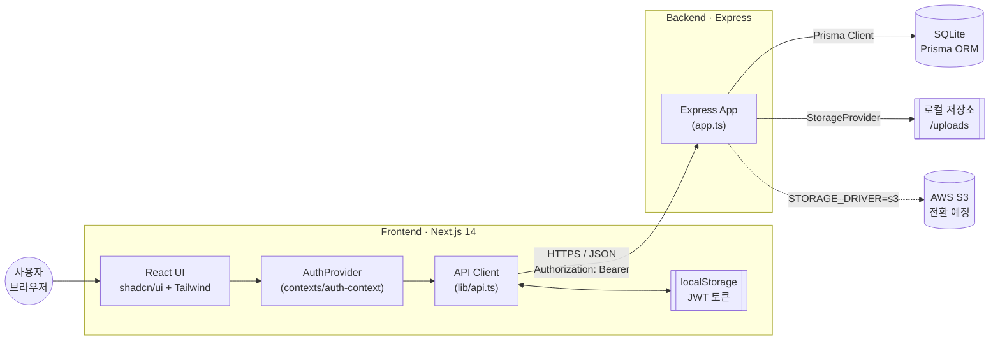
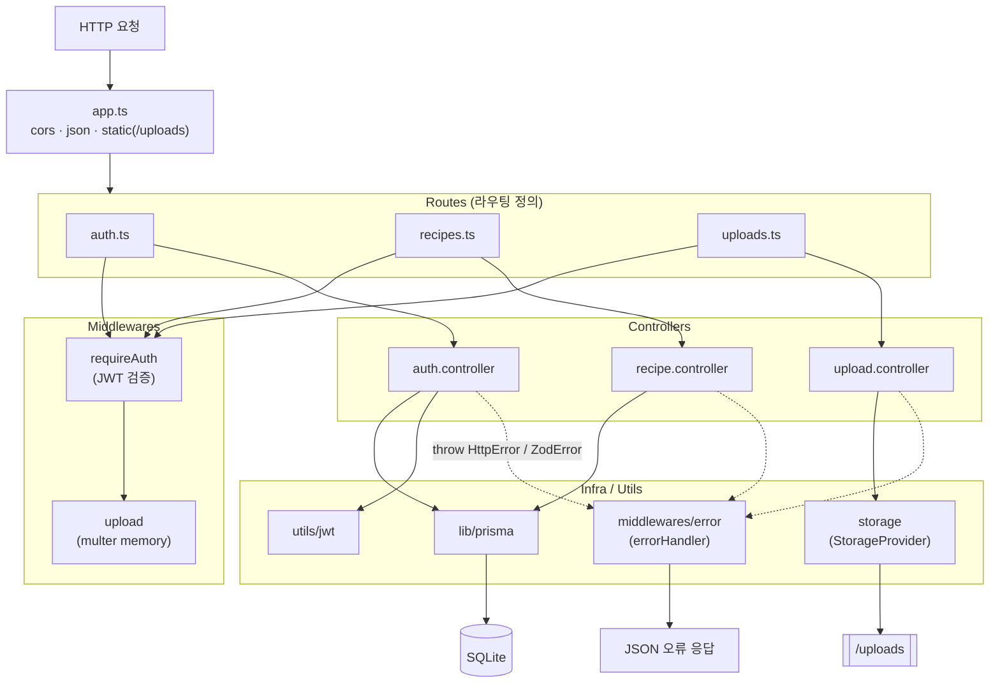
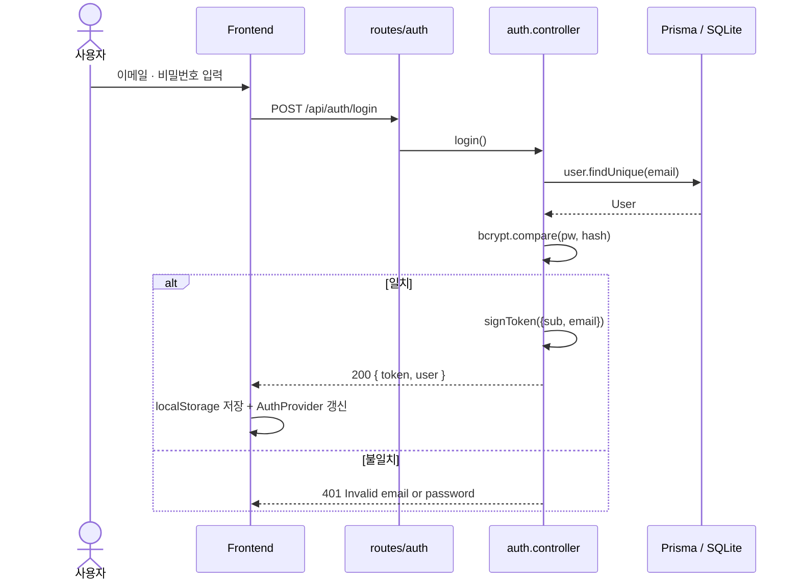
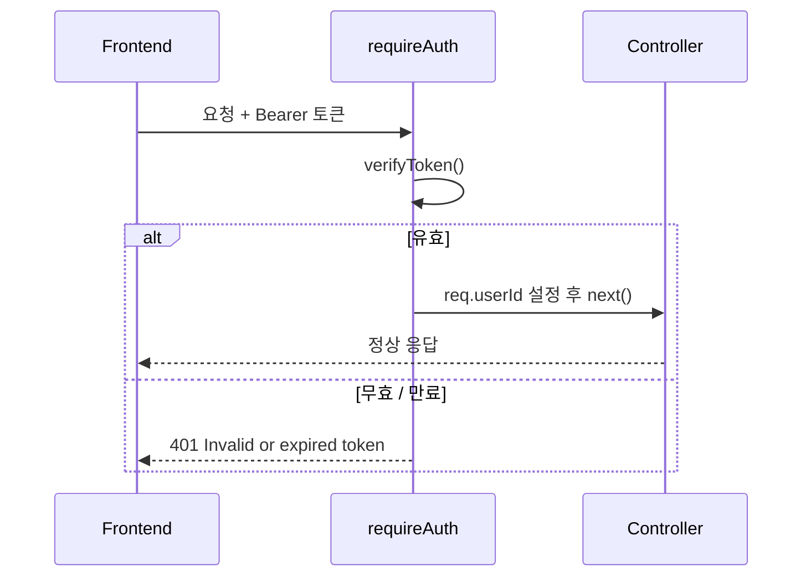
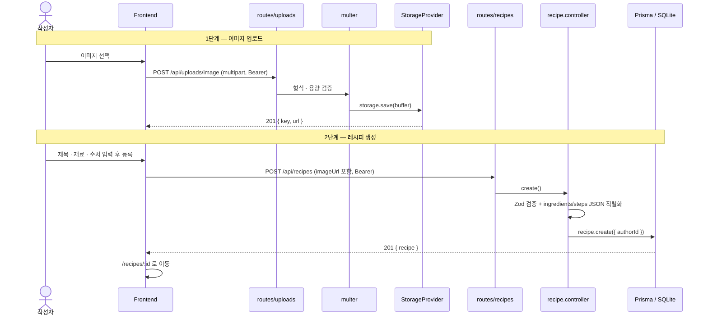
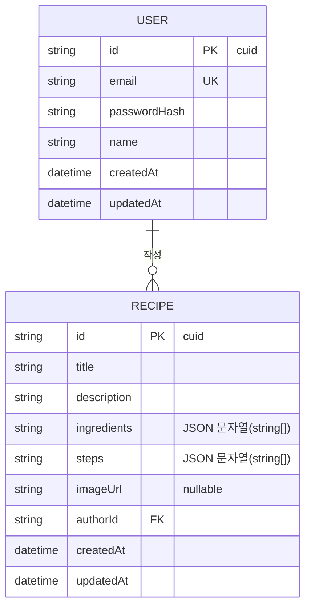
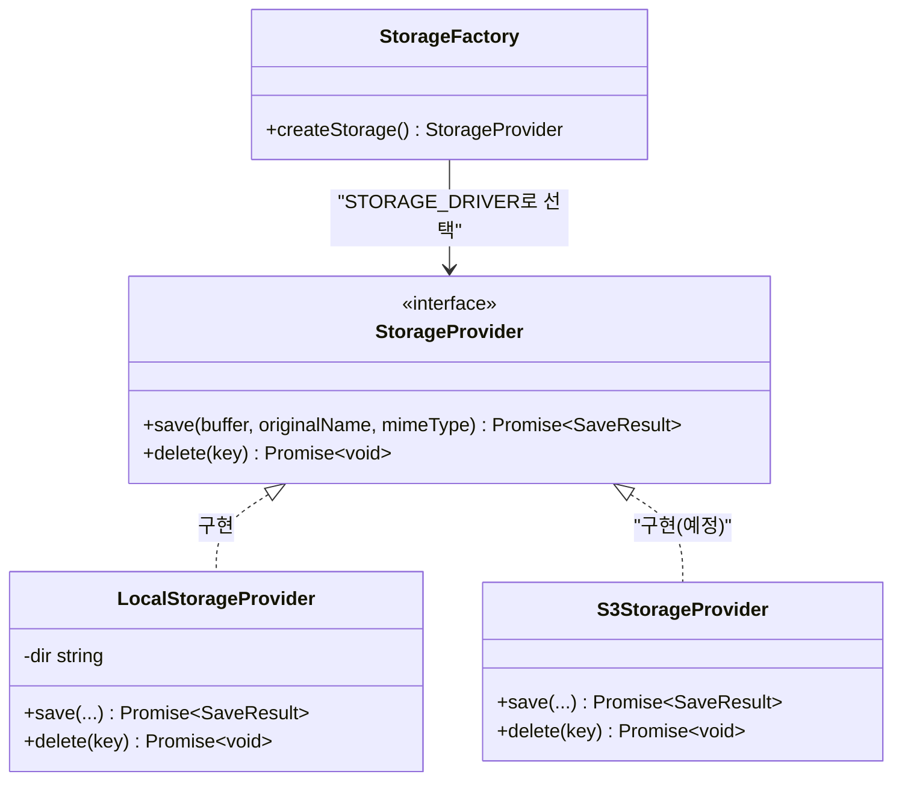
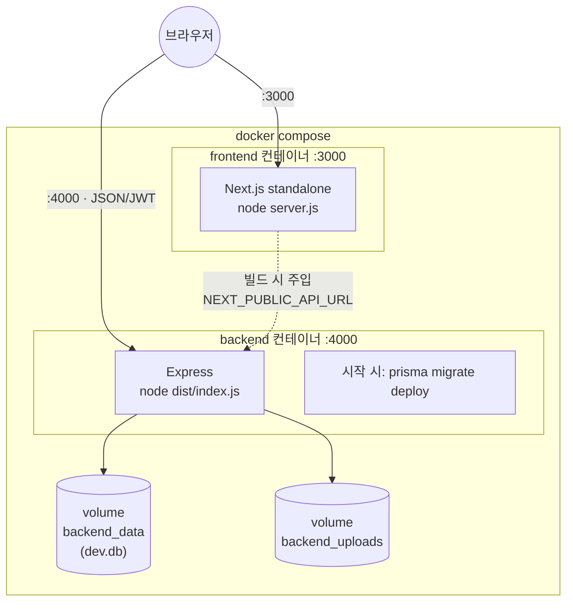

# 🍳 RecipeShare — 아키텍처 문서

현재 코드베이스(`backend/`, `frontend/`) 기준의 시스템 아키텍처입니다.
모든 다이어그램은 Mermaid로 작성되어 GitHub·VS Code·Notion 등에서 렌더링됩니다.

## 기술 스택

| 영역     | 기술                                                                               |
| -------- | ---------------------------------------------------------------------------------- |
| Frontend | Next.js 14 (App Router) · React 18 · TypeScript · Tailwind v4 · shadcn/ui(base-ui) |
| Backend  | Express · TypeScript · Zod(검증)                                                   |
| Database | SQLite (개발) · Prisma ORM                                                         |
| 인증     | JWT (Bearer) · bcrypt                                                              |
| 이미지   | 로컬 파일 저장(`/uploads`) · `StorageProvider`로 S3 전환 추상화                    |
| 배포     | Docker · docker-compose                                                            |

---

## 1. 시스템 구성 (High-level)

---

## 2. 백엔드 레이어 구조

요청은 **Route → Middleware → Controller → (Prisma / Storage)** 순으로 흐르며,
모든 핸들러는 `asyncHandler`로 감싸 예외를 중앙 `errorHandler`로 전달합니다.

---

## 3. 인증 흐름 (로그인 → JWT)

이후 보호된 요청은 `Authorization: Bearer <token>` 헤더를 포함하며,
`requireAuth` 미들웨어가 토큰을 검증하고 `req.userId`를 채웁니다.

---

## 4. 레시피 작성 흐름 (이미지 업로드 포함)

이미지 업로드와 레시피 생성은 **2단계**로 분리되어 있습니다.

---

## 5. 데이터 모델 (ERD)

SQLite에는 네이티브 JSON 타입이 없어 `ingredients`·`steps`는 JSON 문자열로 저장합니다.

> `RECIPE.authorId → USER.id` 관계는 `onDelete: Cascade`로, 사용자 삭제 시 레시피도 함께 삭제됩니다.

---

## 6. 스토리지 추상화 (S3 전환 대비)

앱 코드는 `StorageProvider` 인터페이스에만 의존합니다.
S3 전환 시 `S3StorageProvider`를 추가하고 팩토리(`storage/index.ts`)의 분기만 바꾸면 됩니다.

---

## 7. 배포 구성 (docker-compose)

---

## 디렉터리 매핑 (다이어그램 ↔ 코드)

| 다이어그램 요소 | 코드 위치                                |
| --------------- | ---------------------------------------- |
| API Client      | `frontend/src/lib/api.ts`                |
| AuthProvider    | `frontend/src/contexts/auth-context.tsx` |
| Express App     | `backend/src/app.ts`                     |
| Routes          | `backend/src/routes/`                    |
| Middlewares     | `backend/src/middlewares/`               |
| Controllers     | `backend/src/controllers/`               |
| Prisma Client   | `backend/src/lib/prisma.ts`              |
| StorageProvider | `backend/src/storage/`                   |
| JWT 유틸        | `backend/src/utils/jwt.ts`               |
| 데이터 모델     | `backend/prisma/schema.prisma`           |
| 배포            | `docker-compose.yml`, `*/Dockerfile`     |

> 상세 실행법·API 표·S3 전환 가이드는 [`README.md`](../README.md), MVP 범위는 [`MVP-SPEC.md`](./MVP-SPEC.md),
> C4 모델(Context/Container/Component/Code) 관점은 [`C4-ARCHITECTURE.md`](./C4-ARCHITECTURE.md) 참고.
