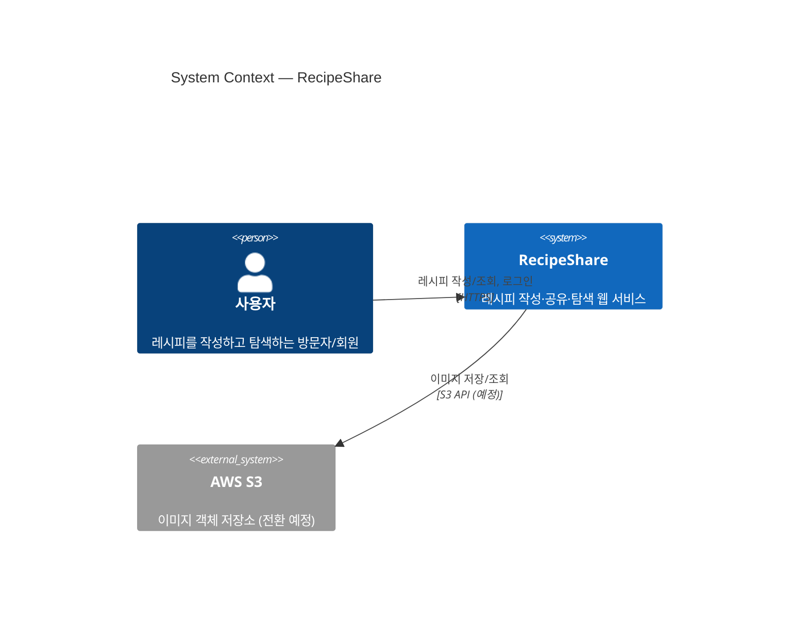
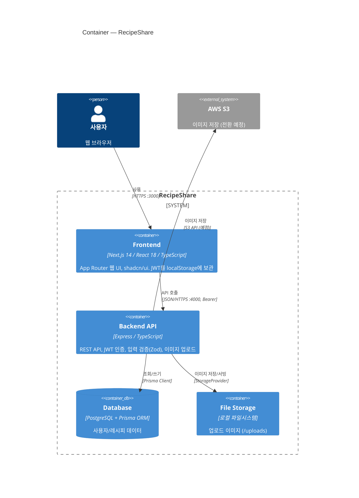
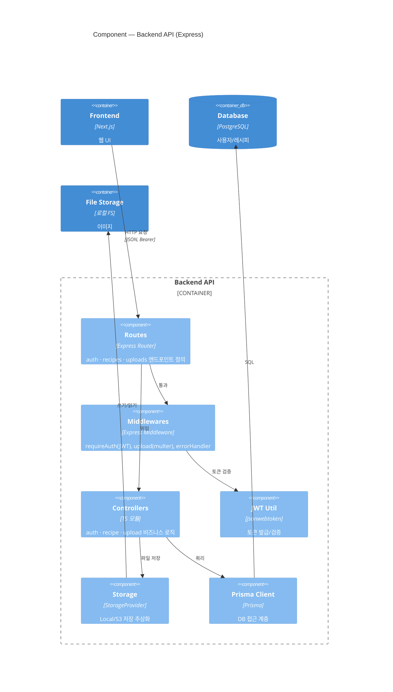
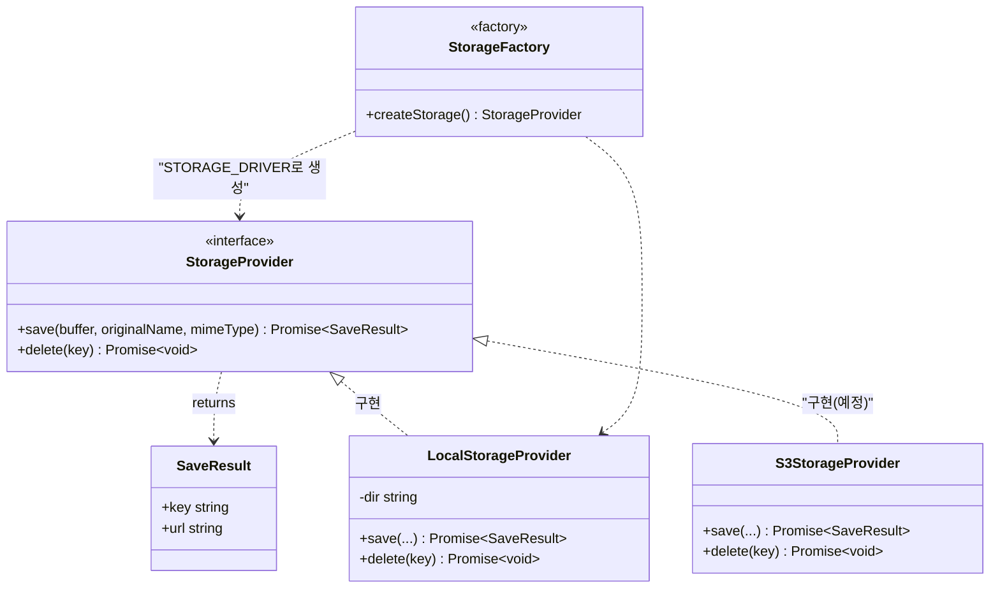

# 🍳 RecipeShare — C4 모델 아키텍처

[C4 모델](https://c4model.com/)의 4단계(Context → Container → Component → Code)로
시스템을 점진적으로 확대하며 설명합니다. 현재 코드베이스 기준입니다.

> 줌 레벨 개념
>
> - **L1 Context** — 누가 쓰고, 무엇과 연결되는가 (가장 큰 그림)
> - **L2 Container** — 어떤 실행 단위(앱/DB/저장소)로 나뉘는가
> - **L3 Component** — 한 컨테이너 내부의 주요 구성요소
> - **L4 Code** — 한 컴포넌트의 실제 코드 구조(클래스/인터페이스)

---

## L1. System Context

RecipeShare를 하나의 블랙박스로 보고, **사용자**와 **외부 시스템**과의 관계만 표현합니다.

**핵심**: 외부 의존성은 (향후의) 이미지 저장소 S3뿐이며, 그 외에는 자체 완결적입니다.
이메일 발송·소셜 로그인 등 외부 시스템은 MVP 범위 밖입니다.

---

## L2. Container

RecipeShare 내부를 **배포·실행 단위(컨테이너)**로 분해합니다.
각 컨테이너는 별도 프로세스로 실행됩니다(docker-compose 기준).

| 컨테이너     | 기술              | 책임                         | 코드               |
| ------------ | ----------------- | ---------------------------- | ------------------ |
| Frontend     | Next.js 14        | UI 렌더링, 라우팅, 토큰 보관 | `frontend/`        |
| Backend API  | Express           | 인증·CRUD·업로드 REST API    | `backend/`         |
| Database     | PostgreSQL/Prisma | 영속 데이터                  | `backend/prisma/`  |
| File Storage | 로컬 FS           | 이미지 바이너리              | `backend/uploads/` |

---

## L3. Component — Backend API

**Backend API 컨테이너** 내부를 확대합니다.
요청은 `Routes → Middlewares → Controllers → (Prisma / Storage)` 순으로 흐릅니다.

| 컴포넌트      | 코드 위치                                        |
| ------------- | ------------------------------------------------ |
| Routes        | `backend/src/routes/{auth,recipes,uploads}.ts`   |
| Middlewares   | `backend/src/middlewares/{auth,upload,error}.ts` |
| Controllers   | `backend/src/controllers/*.controller.ts`        |
| JWT Util      | `backend/src/utils/jwt.ts`                       |
| Storage       | `backend/src/storage/`                           |
| Prisma Client | `backend/src/lib/prisma.ts`                      |

---

## L4. Code — Storage 컴포넌트

가장 깊은 단계로, **Storage 컴포넌트**의 실제 코드 구조(클래스/인터페이스)를 봅니다.
S3 전환이 다른 코드에 영향을 주지 않도록 인터페이스로 분리한 부분입니다.

**코드 레벨 설계 의도**

- 컨트롤러는 구체 클래스가 아닌 `StorageProvider` 인터페이스에만 의존(의존성 역전).
- `createStorage()` 팩토리(`storage/index.ts`)가 `STORAGE_DRIVER` 환경변수로 구현체 선택.
- S3 전환 = `S3StorageProvider` 추가 + 팩토리 분기 1줄. 그 외 코드 무변경.

---

## 요약: 줌 레벨별 매핑

| C4 레벨      | 다이어그램 타입 | 답하는 질문       | 대응 코드                                                     |
| ------------ | --------------- | ----------------- | ------------------------------------------------------------- |
| L1 Context   | `C4Context`     | 누가/무엇과 연결? | 시스템 전체                                                   |
| L2 Container | `C4Container`   | 어떤 실행 단위?   | `frontend/`, `backend/`, `prisma/`, `uploads/`                |
| L3 Component | `C4Component`   | 백엔드 내부 구성? | `routes/`, `middlewares/`, `controllers/`, `storage/`, `lib/` |
| L4 Code      | `classDiagram`  | 실제 클래스 구조? | `backend/src/storage/*.ts`                                    |

> 시퀀스 다이어그램·ERD·배포도는 [`ARCHITECTURE.md`](./ARCHITECTURE.md), MVP 범위는 [`MVP-SPEC.md`](./MVP-SPEC.md) 참고.
