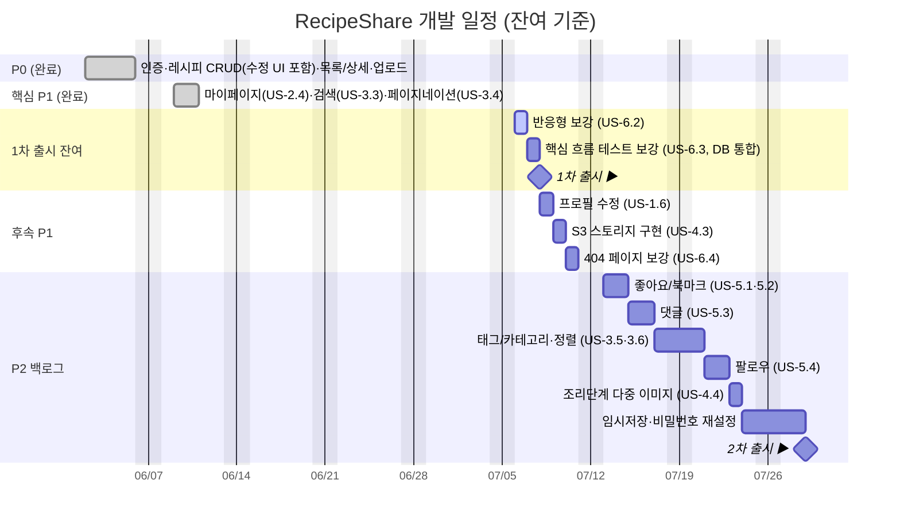

# 🍳 RecipeShare — MVP 기능 명세서

> 레시피 공유 서비스의 최소 기능 제품(MVP) 범위 정의 문서.
> 사용자 스토리 형식 · 우선순위(P0/P1/P2) · 예상 구현 시간 포함.

## 우선순위 정의

| 우선순위 | 의미               | 기준                                             |
| -------- | ------------------ | ------------------------------------------------ |
| **P0**   | 출시 필수 (Must)   | 없으면 서비스가 성립하지 않음. MVP 1차 출시 범위 |
| **P1**   | 출시 권장 (Should) | 사용성·완성도를 위해 필요. 1차 또는 빠른 후속    |
| **P2**   | 추후 (Could)       | 있으면 좋음. MVP 이후 백로그                     |

## 구현 상태 범례

- ✅ 구현 완료 (현재 코드베이스에 존재)
- 🟡 부분 구현
- ⬜ 미구현

## 예상 시간 기준

- 단위: **개발자 1인 기준 시간(h)**, 프론트엔드 + 백엔드 + 기본 테스트 포함
- 1일 = 6 작업시간 가정

---

## Epic 1. 회원 · 인증 (P0)

| ID     | 사용자 스토리                                                                                  | 우선순위 |    상태     | 예상 |
| ------ | ---------------------------------------------------------------------------------------------- | :------: | :---------: | :--: |
| US-1.1 | **방문자**로서, 이메일·비밀번호로 **회원가입**하여 내 계정을 만들 수 있다.                     |    P0    |     ✅      |  4h  |
| US-1.2 | **사용자**로서, 이메일·비밀번호로 **로그인**하여 인증된 기능을 사용할 수 있다.                 |    P0    |     ✅      |  3h  |
| US-1.3 | **사용자**로서, 새로고침 후에도 **로그인 상태가 유지**되길 원한다(토큰 저장/복원).             |    P0    |     ✅      |  2h  |
| US-1.4 | **사용자**로서, **로그아웃**하여 세션을 종료할 수 있다.                                        |    P0    |     ✅      |  1h  |
| US-1.5 | **사용자**로서, 비밀번호가 안전하게 **해시 저장**되고 잘못된 입력에 명확한 오류를 받길 원한다. |    P0    |     ✅      |  2h  |
| US-1.6 | **사용자**로서, 내 **프로필(이름/이메일)을 조회·수정**할 수 있다.                              |    P1    | 🟡 (조회만) |  4h  |
| US-1.7 | **사용자**로서, **비밀번호를 변경/재설정**할 수 있다(이메일 인증 메일).                        |    P2    |     ⬜      | 10h  |

**수용 기준 예시 (US-1.1)**

- 이메일 형식·비밀번호 8자 이상 검증, 중복 이메일은 409 응답
- 성공 시 JWT 발급 및 자동 로그인 상태 전환

---

## Epic 2. 레시피 작성 · 관리 (P0)

| ID     | 사용자 스토리                                                                        | 우선순위 | 상태 | 예상 |
| ------ | ------------------------------------------------------------------------------------ | :------: | :--: | :--: |
| US-2.1 | **로그인 사용자**로서, 제목·설명·재료·조리순서를 입력해 **레시피를 등록**할 수 있다. |    P0    |  ✅  |  6h  |
| US-2.2 | **작성자**로서, 내가 쓴 레시피를 **수정**할 수 있다.                                 |    P0    |  ✅  |  4h  |
| US-2.3 | **작성자**로서, 내가 쓴 레시피를 **삭제**할 수 있다.                                 |    P0    |  ✅  |  2h  |
| US-2.4 | **사용자**로서, **내가 작성한 레시피 목록**을 모아볼 수 있다(마이페이지).            |    P1    |  ✅  |  5h  |
| US-2.5 | **작성자**로서, 작성 중 내용을 **임시저장(draft)**할 수 있다.                        |    P2    |  ⬜  |  8h  |

**수용 기준 예시 (US-2.2 / US-2.3)**

- 작성자 본인만 수정·삭제 가능, 타인 시도 시 403
- 존재하지 않는 레시피는 404

---

## Epic 3. 레시피 탐색 · 조회 (P0)

| ID     | 사용자 스토리                                                          | 우선순위 | 상태 | 예상 |
| ------ | ---------------------------------------------------------------------- | :------: | :--: | :--: |
| US-3.1 | **방문자**로서, **최신 레시피 목록**을 카드 형태로 볼 수 있다.         |    P0    |  ✅  |  4h  |
| US-3.2 | **방문자**로서, 레시피 **상세(재료/순서/이미지/작성자)**를 볼 수 있다. |    P0    |  ✅  |  4h  |
| US-3.3 | **방문자**로서, **키워드로 레시피를 검색**할 수 있다(제목/재료).       |    P1    |  ✅  |  6h  |
| US-3.4 | **방문자**로서, 목록을 **페이지네이션/무한 스크롤**로 탐색할 수 있다.  |    P1    |  ✅  |  5h  |
| US-3.5 | **방문자**로서, **카테고리/태그**로 레시피를 필터링할 수 있다.         |    P2    |  ⬜  |  8h  |
| US-3.6 | **방문자**로서, **인기순/조회순 정렬**로 볼 수 있다.                   |    P2    |  ⬜  |  5h  |

---

## Epic 4. 이미지 업로드 (P1)

| ID     | 사용자 스토리                                                                   | 우선순위 |       상태        | 예상 |
| ------ | ------------------------------------------------------------------------------- | :------: | :---------------: | :--: |
| US-4.1 | **작성자**로서, 레시피 **대표 이미지를 업로드**할 수 있다(로컬 저장).           |    P1    |        ✅         |  5h  |
| US-4.2 | **작성자**로서, 잘못된 형식/과대 용량 업로드 시 **명확한 오류**를 받는다.       |    P1    |        ✅         |  2h  |
| US-4.3 | **운영자**로서, 저장소를 **S3로 전환**해도 코드 변경을 최소화하고 싶다(추상화). |    P1    | 🟡 (인터페이스만) |  6h  |
| US-4.4 | **작성자**로서, 조리 단계별로 **여러 이미지**를 첨부할 수 있다.                 |    P2    |        ⬜         |  8h  |

---

## Epic 5. 소셜 · 참여 (P2)

| ID     | 사용자 스토리                                                   | 우선순위 | 상태 | 예상 |
| ------ | --------------------------------------------------------------- | :------: | :--: | :--: |
| US-5.1 | **사용자**로서, 마음에 드는 레시피에 **좋아요**를 누를 수 있다. |    P2    |  ⬜  |  6h  |
| US-5.2 | **사용자**로서, 레시피를 **북마크/저장**해 모아볼 수 있다.      |    P2    |  ⬜  |  6h  |
| US-5.3 | **사용자**로서, 레시피에 **댓글**을 남길 수 있다.               |    P2    |  ⬜  | 10h  |
| US-5.4 | **사용자**로서, 다른 작성자를 **팔로우**할 수 있다.             |    P2    |  ⬜  | 10h  |

---

## Epic 6. 공통 · 비기능 (Cross-cutting)

| ID     | 사용자 스토리                                                      | 우선순위 |                 상태                 |  예상  |
| ------ | ------------------------------------------------------------------ | :------: | :----------------------------------: | :----: |
| US-6.1 | **사용자**로서, API 오류 시 **일관된 오류 메시지**를 받길 원한다.  |    P0    |                  ✅                  | (포함) |
| US-6.2 | **사용자**로서, 모바일/데스크톱에서 **반응형 UI**로 이용하고 싶다. |    P1    |                  🟡                  |   5h   |
| US-6.3 | **개발자**로서, 핵심 흐름에 대한 **자동화 테스트**가 있길 원한다.  |    P1    | 🟡 (단위+E2E, DB 통합 테스트 미포함) |   8h   |
| US-6.4 | **사용자**로서, 잘못된 경로 접근 시 **404 페이지**를 본다.         |    P1    |                  🟡                  |   2h   |
| US-6.5 | **운영자**로서, **Docker로 일괄 배포**할 수 있다.                  |    P1    |                  ✅                  |   4h   |

---

## 요약 (우선순위별)

> 추정 기준: 개발자 1인, 1일 6 작업시간. 코드 리뷰·QA·디자인은 별도(버퍼 20~30% 권장).

| 우선순위           | 스토리 수 | 시간 합계 | 잔여(미구현+부분) | 잔여 환산  |
| ------------------ | :-------: | :-------: | :---------------: | :--------: |
| **P0** (출시 필수) |    11     |    32h    |        0h         | 0일 (완료) |
| **P1** (출시 권장) |    11     |    52h    |       ~25h        |    ~4일    |
| **P2** (추후)      |     9     |    71h    |       ~71h        |   ~12일    |
| **합계**           |  **31**   | **155h**  |     **~96h**      | **~16일**  |

| 시나리오                      | 합계 시간 |   작업일   | 환산     | 버퍼 30% 포함 |
| ----------------------------- | :-------: | :--------: | -------- | :-----------: |
| 전체 스코프 (신규 가정)       |   155h    |   ~26일    | 약 5주   |   약 6.5주    |
| 현재 완료분 제외 잔여         |   ~96h    |   ~16일    | 약 3주   |    약 4주     |
| **MVP 1차 출시 (P0+핵심 P1)** | **~13h**  | **~2.2일** | **<1주** |  **약 1주**   |

### MVP 1차 출시 권장 범위 (P0 + 핵심 P1)

P0 전체와 핵심 P1 대부분이 이미 구현되어, 남은 두 항목만 마무리하면 1차 출시가 가능합니다.

**완료됨** — 인증, 레시피 CRUD(수정 UI 포함), 목록/상세, 검색(US-3.3), 페이지네이션(US-3.4),
마이페이지/내 레시피 목록(US-2.4), 이미지 업로드

**잔여**

1. US-6.2 **반응형 보강** (5h)
2. US-6.3 **핵심 흐름 테스트 보강**(DB 통합 테스트 추가) — Jest 단위 + Playwright E2E는 구현됨 (8h)

**1차 출시 잔여 추정: 약 13h (≈ 2.2일)**

---

## 개발 일정 (간트 차트)

> 1인 개발 기준, 잔여 작업(~96h)을 우선순위 순으로 배치. 1주 = 5 작업일(30h) 가정.
> 이미 완료된 P0·핵심 P1 기능은 **완료** 섹션으로 표기.

### 주차별 요약

| 주차      | 범위                 | 산출물                                                    |
| --------- | -------------------- | --------------------------------------------------------- |
| **W0**    | P0 (완료)            | 인증, 레시피 CRUD(수정 UI 포함), 목록/상세, 이미지 업로드 |
| **W0.5**  | 핵심 P1 (완료)       | 마이페이지, 검색, 페이지네이션                            |
| **W1**    | 1차 출시 잔여 (~13h) | 반응형 보강·테스트 보강(DB 통합) → **1차 출시**           |
| **W2**    | 후속 P1 (~12h)       | 프로필 수정, S3 전환, 404 보강                            |
| **W3~W5** | P2 백로그 (~71h)     | 좋아요/북마크·댓글·태그·팔로우 등 → **2차 출시**          |

> Mermaid 렌더링이 안 되는 뷰어에서는 위 주차별 요약 표를 참고하세요.
> GitHub·VS Code(Markdown Preview Mermaid)·Notion 등에서는 간트 차트가 그대로 렌더링됩니다.

---

## 비고

- ✅ 상태는 현재 코드베이스(`backend/`, `frontend/`) 기준이며, 실제 동작(로그인→작성→조회→401)
  스모크 테스트로 확인됨.
- 예상 시간은 단일 개발자·기존 스택(Next.js 14 / Express / Prisma+SQLite / JWT) 가정값이며,
  코드 리뷰·QA·디자인 조정 시간은 별도.
- P2 항목(좋아요/댓글/팔로우)은 데이터 모델 확장(스키마 마이그레이션)이 필요하므로
  MVP 이후 별도 스프린트로 분리 권장.
