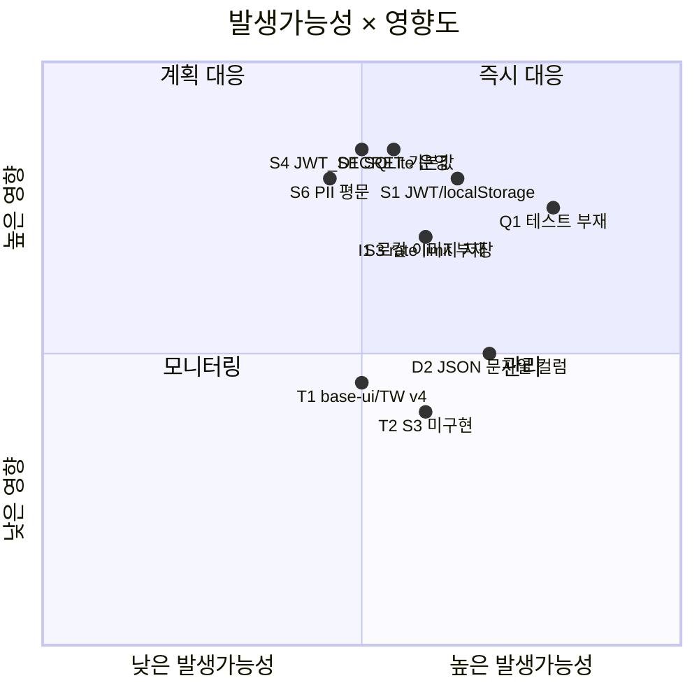

# 🍳 RecipeShare — 리스크 분석

현재 설계·구현 결과물(`backend/`, `frontend/`, 설계 문서)을 근거로 한 리스크 분석입니다.
일반론이 아니라 **실제 구현 선택**을 짚어 평가했습니다.

> - 척도: 발생가능성/영향도 = **H(높음) / M(보통) / L(낮음)**
> - 등급 = 가능성 × 영향 → 🔴 높음 · 🟠 중간 · 🟡 낮음
> - 상태: 현재 코드 기준 (✅ 대응됨 · 🟡 부분 · ⬜ 미대응)

---

## 리스크 매트릭스 (Top 리스크)

---

## 1. 보안 (Security)

| ID  | 리스크                                                                                        | 근거(코드)                               | 가능성 | 영향 | 등급 |    상태    | 완화 방안                                           |
| --- | --------------------------------------------------------------------------------------------- | ---------------------------------------- | :----: | :--: | :--: | :--------: | --------------------------------------------------- |
| S1  | **JWT를 localStorage에 저장** → XSS 시 토큰 탈취                                              | `frontend/src/lib/api.ts` `tokenStore`   |   M    |  H   |  🔴  |     ⬜     | httpOnly·Secure·SameSite 쿠키로 전환, CSP 헤더 적용 |
| S2  | 토큰 **폐기/리프레시 없음**, 7일 만료, 로그아웃은 클라이언트 전용                             | `utils/jwt.ts`, `auth-context`           |   M    |  H   |  🔴  |     ⬜     | 짧은 access + refresh 토큰, 서버측 블랙리스트/회전  |
| S3  | 인증 엔드포인트 **rate limiting 부재** → 무차별 대입·크리덴셜 스터핑                          | `routes/auth.ts`                         |   M    |  H   |  🔴  |     ⬜     | `express-rate-limit`, 로그인 실패 지연/락아웃       |
| S4  | **JWT_SECRET 기본값**이 `.env.example`·`docker-compose.yml`에 존재 → 그대로 배포 시 토큰 위조 | 배포 설정                                |   M    |  H   |  🔴  | 🟡(경고만) | 부팅 시 기본값/약한 시크릿 거부, 시크릿 매니저 사용 |
| S5  | 업로드 **MIME 헤더만 검증**(매직바이트 미검증) + 정적 무인증 서빙                             | `middlewares/upload.ts`, `app.ts static` |   M    |  M   |  🟠  |     🟡     | 매직바이트 검사, 재인코딩(sharp), 서명 URL/접근통제 |
| S6  | **개인정보(이메일·이름) 평문 저장**, 마스킹/암호화/접근통제 없음 (개인정보보호법)             | `schema.prisma` User                     |   M    |  H   |  🔴  |     ⬜     | 저장 암호화·접근 로깅·로그 마스킹, 최소수집 원칙    |

> ⚠️ 본 문서에는 실제 시크릿/키 값을 포함하지 않습니다. `JWT_SECRET` 등은 시크릿 매니저로 주입하세요.

## 2. 데이터 · DB

| ID  | 리스크                                                                   | 근거                                 | 가능성 | 영향 | 등급 |      상태       | 완화 방안                                                  |
| --- | ------------------------------------------------------------------------ | ------------------------------------ | :----: | :--: | :--: | :-------------: | ---------------------------------------------------------- |
| D1  | **SQLite 운영 부적합** — 단일 writer, 동시성·다중 인스턴스 한계          | `schema.prisma` provider=sqlite      |   M    |  H   |  🔴  | ⬜(개발용 명시) | 운영은 PostgreSQL로 전환(provider+URL 변경)                |
| D2  | `ingredients`/`steps`를 **JSON 문자열**로 저장 → 검색/정합성/인덱싱 제약 | `schema.prisma`, `recipe.controller` |   H    |  M   |  🟠  |       🟡        | 정규화 테이블 또는 Postgres JSONB로 이전(검색 US-3.3 선행) |
| D3  | User 삭제 시 Recipe **Cascade 삭제** → 대량 데이터 손실 가능             | `onDelete: Cascade`                  |   L    |  M   |  🟡  |   ⚠️의도 확인   | soft delete, 삭제 전 확인/백업                             |
| D4  | SQLite→Postgres 전환 시 타입/동작 차이                                   | 스키마                               |   M    |  M   |  🟠  |       ⬜        | 조기에 운영 DB로 통합 테스트                               |

## 3. 인프라 · 확장성

| ID  | 리스크                                                                             | 근거                                   | 가능성 | 영향 | 등급 |     상태     | 완화 방안                                       |
| --- | ---------------------------------------------------------------------------------- | -------------------------------------- | :----: | :--: | :--: | :----------: | ----------------------------------------------- |
| I1  | **로컬 파일 저장** → 컨테이너 다중화/재배포 시 이미지 유실(볼륨 의존)              | `LocalStorageProvider`, compose volume |   M    |  H   |  🔴  |   🟡(볼륨)   | S3 전환(US-4.3) 우선순위 상향                   |
| I2  | 목록 API **페이지네이션 없음**(`findMany` 전체) → 데이터 증가 시 성능 저하         | `recipe.controller list`               |   M    |  M   |  🟠  |      ⬜      | 커서/오프셋 페이지네이션(US-3.4)                |
| I3  | 컨테이너 시작 시 `prisma migrate deploy` → **다중 replica 동시 마이그레이션 경쟁** | `backend/Dockerfile` CMD               |   M    |  M   |  🟠  |      ⬜      | 마이그레이션을 배포 잡으로 분리(init container) |
| I4  | `multer.memoryStorage` + 동시 업로드 → 메모리 압박/DoS                             | `middlewares/upload.ts`                |   L    |  M   |  🟡  | 🟡(5MB 제한) | 디스크/스트리밍 업로드, 동시성 제한             |

## 4. 의존성 · 기술

| ID  | 리스크                                                                            | 근거                             | 가능성 | 영향 | 등급 |     상태      | 완화 방안                                       |
| --- | --------------------------------------------------------------------------------- | -------------------------------- | :----: | :--: | :--: | :-----------: | ----------------------------------------------- |
| T1  | **base-ui(shadcn) 실험적 + Tailwind v4 최신** → 파괴적 변경 (실제 빌드 깨짐 경험) | `components/ui/*`, `globals.css` |   M    |  M   |  🟠  | ✅(현재 동작) | 버전 고정, 정기 업그레이드 검증, 변경 로그 추적 |
| T2  | **S3StorageProvider 미구현**(호출 시 throw) → 전환 시 추가 개발 필요              | `storage/index.ts` `case 's3'`   |   M    |  M   |  🟠  |      ⬜       | 인터페이스는 준비됨; 구현·통합 테스트 일정 확보 |

## 5. 품질 · 운영

| ID  | 리스크                                                   | 근거                 | 가능성 | 영향 | 등급 | 상태 | 완화 방안                              |
| --- | -------------------------------------------------------- | -------------------- | :----: | :--: | :--: | :--: | -------------------------------------- |
| Q1  | **자동화 테스트 부재**(US-6.3 미완) → 회귀·리팩터링 취약 | 테스트 코드 없음     |   H    |  H   |  🔴  |  ⬜  | 1차 출시 전 핵심 흐름 통합 테스트 확보 |
| Q2  | **관측성(로깅/모니터링) 없음** → 장애 탐지·원인분석 지연 | 구조화 로그/APM 없음 |   M    |  M   |  🟠  |  ⬜  | 요청 로깅·에러 추적(Sentry)·헬스 알림  |

## 6. 일정 · 범위

| ID  | 리스크                                                       | 근거             | 가능성 | 영향 | 등급 |     상태      | 완화 방안                                 |
| --- | ------------------------------------------------------------ | ---------------- | :----: | :--: | :--: | :-----------: | ----------------------------------------- |
| P1  | 1인 추정·기본 버퍼 없음 → 일정 초과                          | `WBS.md`         |   M    |  M   |  🟠  | 🟡(버퍼 권고) | 버퍼 20~30% 반영, 주간 번다운 점검        |
| P2  | P2 소셜 기능이 **스키마 확장** 필요 → 범위 확대·마이그레이션 | `MVP-SPEC` Epic5 |   M    |  M   |  🟠  |      ⬜       | 데이터 모델 사전 설계, 별도 스프린트 분리 |

---

## Top 5 우선 대응 (출시 게이트)

| 순위 | 리스크                            | 권장 조치                                     | 연계                         |
| :--: | --------------------------------- | --------------------------------------------- | ---------------------------- |
|  1   | **Q1 테스트 부재**                | 인증·CRUD·업로드 핵심 흐름 통합 테스트        | US-6.3 (1차 출시 포함)       |
|  2   | **S1·S2·S3 인증 보안**            | httpOnly 쿠키 + refresh 토큰 + rate limiting  | 신규 보안 작업(권장 P0 승격) |
|  3   | **S4 시크릿 기본값**              | 부팅 시 약한 시크릿 거부 + 시크릿 매니저      | `config/env.ts` 보강         |
|  4   | **D1 SQLite 운영 / I1 로컬 저장** | 운영 PostgreSQL + S3 전환 계획 확정           | US-4.3, 인프라 결정          |
|  5   | **S6 PII 처리**                   | 로그 마스킹·접근통제·최소수집(개인정보보호법) | 규정 준수 검토               |

## 권장 신규 작업 (WBS 반영 제안)

- **보안 하드닝 work package 신설** (S1~S4): ~12h, 1차 출시 전 권장
- **운영 DB/스토리지 결정** (D1, I1, T2): 아키텍처 의사결정 + ~10h
- **관측성 기본** (Q2): 요청 로깅 + 에러 추적 ~4h

---

## 비고

- 등급은 **현재가 개발/MVP 단계**라는 전제의 상대 평가입니다. 운영 전환 시 D1·I1·S계열은 영향도가 상향됩니다.
- 보안 항목은 권한 있는 환경에서의 방어적 개선을 전제로 합니다. 실제 시크릿/키는 본 문서·코드·로그에 절대 포함하지 마세요.
- 우선순위·시간은 [`MVP-SPEC.md`](./MVP-SPEC.md)·[`WBS.md`](./WBS.md)와 함께 갱신하세요.
