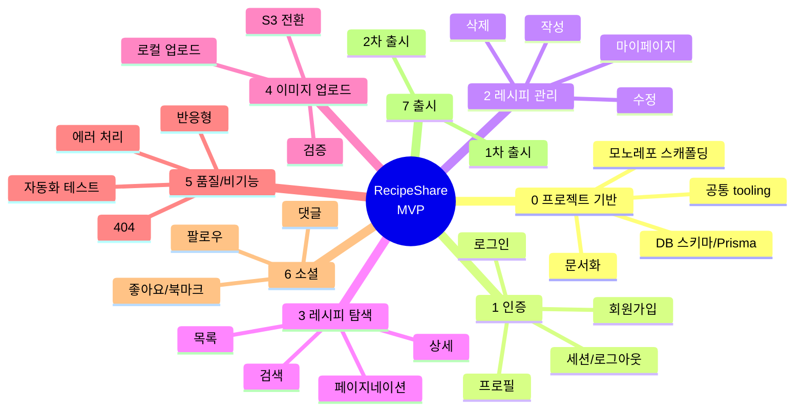

# 🍳 RecipeShare — WBS (Work Breakdown Structure)

프로젝트 작업을 산출물 중심으로 계층 분해한 문서입니다.
[`MVP-SPEC.md`](./MVP-SPEC.md)의 Epic·사용자 스토리(US)·추정 시간과 일치합니다.

> - 추정 기준: 개발자 1인, 1일 6 작업시간. 코드 리뷰·QA는 별도(버퍼 20~30% 권장).
> - 상태: ✅ 완료 · 🟡 부분 · ⬜ 미착수
> - **기능 작업 합계 = 155h**(MVP-SPEC와 동일). 기반 작업(0번)은 이미 투입된 셋업으로 별도 집계.

---

## WBS 트리

---

## 0. 프로젝트 기반 (Foundation) — ✅ 완료 (기능 외 셋업)

| WBS | 작업 패키지        | 산출물                                             |  시간   | 상태 |
| --- | ------------------ | -------------------------------------------------- | :-----: | :--: |
| 0.1 | 모노레포 스캐폴딩  | `frontend/`(Next.js 14) + `backend/`(Express)      |   6h    |  ✅  |
| 0.2 | 공통 tooling       | ESLint · Prettier · lint-staged · Git hooks        |   3h    |  ✅  |
| 0.3 | DB 스키마 & Prisma | `schema.prisma`(User/Recipe) + 마이그레이션 + seed |   3h    |  ✅  |
| 0.4 | 문서화             | README · MVP-SPEC · ARCHITECTURE · C4 · WBS        |   4h    |  ✅  |
|     | **소계**           |                                                    | **16h** |      |

---

## 1. 인증 (Auth)

| WBS | 작업 패키지               | US     |  시간   | 우선 | 상태 | 선행 |
| --- | ------------------------- | ------ | :-----: | :--: | :--: | :--: |
| 1.1 | 회원가입 (API+UI, bcrypt) | US-1.1 |   4h    |  P0  |  ✅  | 0.3  |
| 1.2 | 로그인 (JWT 발급)         | US-1.2 |   3h    |  P0  |  ✅  | 1.1  |
| 1.3 | 세션 유지/복원            | US-1.3 |   2h    |  P0  |  ✅  | 1.2  |
| 1.4 | 로그아웃                  | US-1.4 |   1h    |  P0  |  ✅  | 1.2  |
| 1.5 | 비밀번호 해시·검증 처리   | US-1.5 |   2h    |  P0  |  ✅  | 1.1  |
| 1.6 | 프로필 조회/수정          | US-1.6 |   4h    |  P1  |  🟡  | 1.2  |
| 1.7 | 비밀번호 재설정(메일)     | US-1.7 |   10h   |  P2  |  ⬜  | 1.2  |
|     | **소계**                  |        | **26h** |      |      |      |

## 2. 레시피 관리 (Recipe)

| WBS | 작업 패키지               | US     |  시간   | 우선 | 상태 | 선행 |
| --- | ------------------------- | ------ | :-----: | :--: | :--: | :--: |
| 2.1 | 레시피 작성 (CRUD-Create) | US-2.1 |   6h    |  P0  |  ✅  | 1.2  |
| 2.2 | 레시피 수정               | US-2.2 |   4h    |  P0  |  ✅  | 2.1  |
| 2.3 | 레시피 삭제               | US-2.3 |   2h    |  P0  |  ✅  | 2.1  |
| 2.4 | 내 레시피/마이페이지      | US-2.4 |   5h    |  P1  |  ✅  | 2.1  |
| 2.5 | 임시저장(draft)           | US-2.5 |   8h    |  P2  |  ⬜  | 2.1  |
|     | **소계**                  |        | **25h** |      |      |      |

## 3. 레시피 탐색 (Discovery)

| WBS | 작업 패키지             | US     |  시간   | 우선 | 상태 | 선행 |
| --- | ----------------------- | ------ | :-----: | :--: | :--: | :--: |
| 3.1 | 레시피 목록             | US-3.1 |   4h    |  P0  |  ✅  | 2.1  |
| 3.2 | 레시피 상세             | US-3.2 |   4h    |  P0  |  ✅  | 2.1  |
| 3.3 | 키워드 검색             | US-3.3 |   6h    |  P1  |  ✅  | 3.1  |
| 3.4 | 페이지네이션/무한스크롤 | US-3.4 |   5h    |  P1  |  ✅  | 3.1  |
| 3.5 | 카테고리/태그 필터      | US-3.5 |   8h    |  P2  |  ⬜  | 3.1  |
| 3.6 | 인기/조회순 정렬        | US-3.6 |   5h    |  P2  |  ⬜  | 3.1  |
|     | **소계**                |        | **32h** |      |      |      |

## 4. 이미지 업로드 (Upload)

| WBS | 작업 패키지        | US     |  시간   | 우선 |  상태  | 선행 |
| --- | ------------------ | ------ | :-----: | :--: | :----: | :--: |
| 4.1 | 로컬 이미지 업로드 | US-4.1 |   5h    |  P1  |   ✅   | 0.1  |
| 4.2 | 형식/용량 검증     | US-4.2 |   2h    |  P1  |   ✅   | 4.1  |
| 4.3 | S3 스토리지 전환   | US-4.3 |   6h    |  P1  | 🟡(IF) | 4.1  |
| 4.4 | 단계별 다중 이미지 | US-4.4 |   8h    |  P2  |   ⬜   | 4.1  |
|     | **소계**           |        | **21h** |      |        |      |

## 5. 품질 · 비기능 (Quality / Cross-cutting)

| WBS | 작업 패키지             | US     |  시간   | 우선 | 상태 | 선행  |
| --- | ----------------------- | ------ | :-----: | :--: | :--: | :---: |
| 5.1 | 일관된 에러 처리        | US-6.1 | (포함)  |  P0  |  ✅  |  0.1  |
| 5.2 | 반응형 UI 보강          | US-6.2 |   5h    |  P1  |  🟡  |  3.2  |
| 5.3 | 핵심 흐름 자동화 테스트 | US-6.3 |   8h    |  P1  |  ⬜  | 1·2·3 |
| 5.4 | 404 페이지              | US-6.4 |   2h    |  P1  |  🟡  |  0.1  |
| 5.5 | Docker 배포 구성        | US-6.5 |   4h    |  P1  |  ✅  |  0.1  |
|     | **소계**                |        | **19h** |      |      |       |

## 6. 소셜 · 참여 (Social) — P2

| WBS | 작업 패키지 | US     |  시간   | 우선 | 상태 | 선행 |
| --- | ----------- | ------ | :-----: | :--: | :--: | :--: |
| 6.1 | 좋아요      | US-5.1 |   6h    |  P2  |  ⬜  | 3.2  |
| 6.2 | 북마크/저장 | US-5.2 |   6h    |  P2  |  ⬜  | 3.2  |
| 6.3 | 댓글        | US-5.3 |   10h   |  P2  |  ⬜  | 3.2  |
| 6.4 | 팔로우      | US-5.4 |   10h   |  P2  |  ⬜  | 1.2  |
|     | **소계**    |        | **32h** |      |      |      |

## 7. 출시 (Release) — 마일스톤

| WBS | 작업 패키지    | 포함 범위                                       | 잔여 |  선행   |
| --- | -------------- | ----------------------------------------------- | :--: | :-----: |
| 7.1 | **1차 출시** ▶ | 5.2, 5.3 _(2.2·2.4·3.3·3.4는 완료)_             | ~13h | 위 항목 |
| 7.2 | **2차 출시** ▶ | 1.6, 4.3, 5.4 + 6.x(소셜) + 1.7/2.5/3.5/3.6/4.4 | ~83h |   7.1   |

---

## 롤업 요약

| WBS 그룹             | 시간 합계 |  잔여(미구현+부분)   |
| -------------------- | :-------: | :------------------: |
| 1. 인증              |    26h    |   ~14h (1.6, 1.7)    |
| 2. 레시피 관리       |    25h    |      ~8h (2.5)       |
| 3. 레시피 탐색       |    32h    |   ~13h (3.5, 3.6)    |
| 4. 이미지 업로드     |    21h    |   ~14h (4.3, 4.4)    |
| 5. 품질·비기능       |    19h    | ~15h (5.2, 5.3, 5.4) |
| 6. 소셜              |    32h    |         ~32h         |
| **기능 합계**        | **155h**  |       **~96h**       |
| 0. 기반 (완료, 별도) |    16h    |          0h          |

| 마일스톤       | 잔여 | 작업일 | 환산(버퍼 30%) |
| -------------- | :--: | :----: | :------------: |
| 1차 출시       | ~13h | ~2.2일 |      ~1주      |
| 2차 출시(전체) | ~96h | ~16일  |      ~4주      |

---

## 비고

- WBS 코드는 `그룹.작업` 2단계로, 필요 시 `1.1.1`처럼 활동(activity) 단위로 더 세분화 가능.
- 시간은 프론트+백엔드+기본 테스트 포함 추정이며, 설계·QA·배포 운영 작업은 마일스톤(7.x)과 5.3/5.5에 일부 반영.
- 우선순위·상태·시간은 [`MVP-SPEC.md`](./MVP-SPEC.md)와 단일 출처로 동기화되어 있으니, 변경 시 두 문서를 함께 갱신하세요.

> _CI 파이프라인 검증용 PR — 병합 후 삭제 예정._
